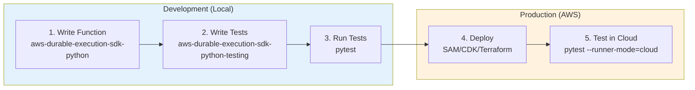

# Getting started

## Table of Contents

- [Overview](#overview)
- [The two SDKs](#the-two-sdks)
- [How durable execution works](#how-durable-execution-works)
- [Your development workflow](#your-development-workflow)
- [Quick start](#quick-start)
- [Next steps](#next-steps)

[← Back to main index](index.md)

## Overview

This guide explains the fundamental concepts behind durable execution and how the SDK works. You'll understand:

- The difference between `aws-durable-execution-sdk-python` and `aws-durable-execution-sdk-python-testing`
- How checkpoints and replay enable reliable workflows
- Why your function code runs multiple times but side effects happen once
- The development workflow from writing to testing to deployment

[↑ Back to top](#table-of-contents)

## The two SDKs

The durable execution ecosystem has two separate packages:

### Execution SDK (aws-durable-execution-sdk-python)

This is the **core SDK** that runs in your Lambda functions. It provides:

- `DurableContext` - The main interface for durable operations
- Operations - Steps, waits, callbacks, parallel, map, child contexts
- Decorators - `@durable_execution`, `@durable_step`, etc.
- Configuration - StepConfig, CallbackConfig, retry strategies
- Serialization - How data is saved in checkpoints

Install it in your Lambda deployment package:

```console
pip install aws-durable-execution-sdk-python
```

### Testing SDK (aws-durable-execution-sdk-python-testing)

This is a **separate SDK** for testing your durable functions. It provides:

- `DurableFunctionTestRunner` - Run functions locally without AWS
- `DurableFunctionCloudTestRunner` - Test deployed Lambda functions
- Pytest integration - Fixtures and markers for writing tests
- Result inspection - Examine execution state and operation results

Install it in your development environment only:

```console
pip install aws-durable-execution-sdk-python-testing
```

**Key distinction:** The execution SDK runs in production Lambda. The testing SDK runs on your laptop or CI/CD. They're separate concerns.

[↑ Back to top](#table-of-contents)

## How durable execution works

Let's trace through a simple workflow to understand the execution model:

```python
@durable_execution
def handler(event: dict, context: DurableContext) -> dict:
    # Step 1: Call external API
    data = context.step(fetch_data(event["id"]))
    
    # Step 2: Wait 30 seconds
    context.wait(seconds=30)
    
    # Step 3: Process the data
    result = context.step(process_data(data))
    
    return result
```

**First invocation (t=0s):**

1. Lambda invokes your function
2. `fetch_data` executes and calls an external API
3. Result is checkpointed to AWS
4. `context.wait(seconds=30)` is reached
5. Function returns, Lambda can recycle the environment

**Second invocation (t=30s):**

1. Lambda invokes your function again
2. Function code runs from the beginning
3. `fetch_data` returns the checkpointed result instantly (no API call)
4. `context.wait(seconds=30)` is already complete, execution continues
5. `process_data` executes for the first time
6. Result is checkpointed
7. Function returns the final result

**Key insights:**

- Your function code runs twice, but `fetch_data` only calls the API once
- The wait doesn't block Lambda - your environment can be recycled
- You write linear code that looks synchronous
- The SDK handles all the complexity of state management

[↑ Back to top](#table-of-contents)

## Your development workflow



Here's how you build and test durable functions:

### 1. Write your function (execution SDK)

Install the execution SDK and write your Lambda handler:

```console
pip install aws-durable-execution-sdk-python
```

```python
from aws_durable_execution_sdk_python import (
    DurableContext,
    durable_execution,
    durable_step,
)

@durable_step
def my_step(step_context, data):
    # Your business logic
    return result

@durable_execution
def handler(event, context: DurableContext):
    result = context.step(my_step(event["data"]))
    return result
```

### 2. Test locally (testing SDK)

Install the testing SDK and write tests:

```console
pip install aws-durable-execution-sdk-python-testing
```

```python
import pytest
from my_function import handler

@pytest.mark.durable_execution(handler=handler, lambda_function_name="my_function")
def test_my_function(durable_runner):
    with durable_runner:
        result = durable_runner.run(input={"data": "test"}, timeout=10)
    assert result.status == "SUCCEEDED"
```

Run tests without AWS credentials:

```console
pytest test_my_function.py
```

### 3. Deploy to Lambda

Package your function with the execution SDK (not the testing SDK) and deploy using your preferred tool (SAM, CDK, Terraform, etc.).

### 4. Test in the cloud (optional)

Run the same tests against your deployed function:

```console
export AWS_REGION=us-west-2
export QUALIFIED_FUNCTION_NAME="MyFunction:$LATEST"
export LAMBDA_FUNCTION_TEST_NAME="my_function"

pytest --runner-mode=cloud test_my_function.py
```

[↑ Back to top](#table-of-contents)

## Quick start

Ready to build your first durable function? Here's a minimal example:

```python
from aws_durable_execution_sdk_python import (
    DurableContext,
    durable_execution,
    durable_step,
    StepContext,
)

@durable_step
def greet_user(step_context: StepContext, name: str) -> str:
    """Generate a greeting."""
    return f"Hello {name}!"

@durable_execution
def handler(event: dict, context: DurableContext) -> str:
    """Simple durable function."""
    name = event.get("name", "World")
    greeting = context.step(greet_user(name))
    return greeting
```

Deploy this to Lambda and you have a durable function. The `greet_user` step is checkpointed automatically.

### Using a custom boto3 Lambda client

If you need to customize the boto3 Lambda client used for durable execution operations (for example, to configure custom endpoints, retry settings, or credentials), you can pass a `boto3_client` parameter to the decorator. The client must be a boto3 Lambda client:

```python
import boto3
from botocore.config import Config
from aws_durable_execution_sdk_python import durable_execution, DurableContext

# Create a custom boto3 Lambda client with specific configuration
custom_lambda_client = boto3.client(
    'lambda',
    config=Config(
        retries={'max_attempts': 5, 'mode': 'adaptive'},
        connect_timeout=10,
        read_timeout=60,
    )
)

@durable_execution(boto3_client=custom_lambda_client)
def handler(event: dict, context: DurableContext) -> dict:
    # Your durable function logic
    return {"status": "success"}
```

The custom Lambda client is used for all checkpoint and state management operations. If you don't provide a `boto3_client`, the SDK initializes a default Lambda client from your environment.

[↑ Back to top](#table-of-contents)

## Next steps

Now that you've built your first durable function, explore the core features:

**Learn the operations:**
- [Steps](core/steps.md) - Execute code with retry strategies and checkpointing
- [Wait operations](core/wait.md) - Pause execution for seconds, minutes, or hours
- [Callbacks](core/callbacks.md) - Wait for external systems to respond
- [Child contexts](core/child-contexts.md) - Organize complex workflows
- [Parallel operations](core/parallel.md) - Run multiple operations concurrently
- [Map operations](core/map.md) - Process collections in parallel

**Dive deeper:**
- [Error handling](advanced/error-handling.md) - Handle failures and implement retry strategies
- [Testing patterns](testing-patterns/basic-tests.md) - Write effective tests for your workflows
- [Best practices](best-practices.md) - Avoid common pitfalls

[↑ Back to top](#table-of-contents)

## See also

- [Documentation index](index.md) - Browse all guides and examples
- [Architecture diagrams](architecture.md) - Class diagrams and concurrency flows
- [Logger integration](core/logger.md) - Replay-safe structured logging
- [Examples directory](https://github.com/awslabs/aws-durable-execution-sdk-python/tree/main/examples) - More working examples

[↑ Back to top](#table-of-contents)

## License

See the [LICENSE](../LICENSE) file for our project's licensing.

[↑ Back to top](#table-of-contents)
